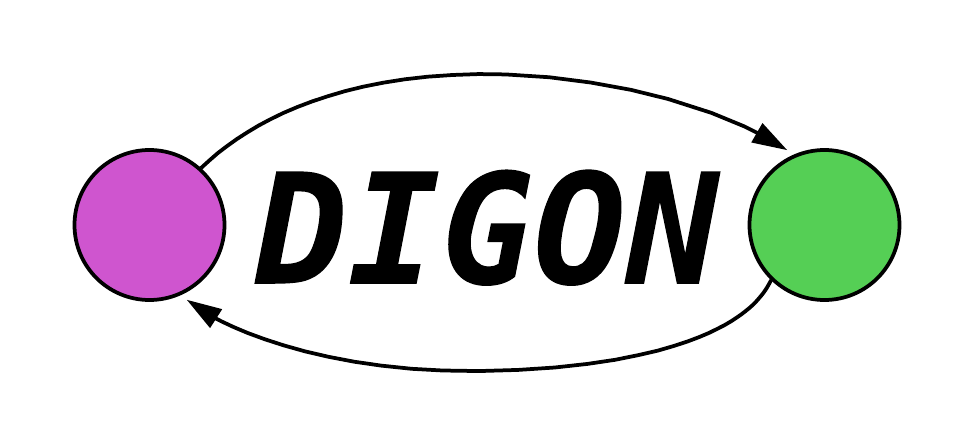

-----------------

Documentation 
  

-----------------
# Overview
A graph-based programming language for naturally concurrent and well-structured 
code.

Created by Sebastian Coates and John Tagliaferro at Tufts University.

Disclaimer: Digon is not affiliated with Google or the Go programming language.

## Current Status
The stats example compiles successfully despite many complaints from
the lexer. Simple Digon (code that forms a DAG) may also compile successfully.  

Some Digon-specific syntax will compile, including the essential 
node-linking syntax. Otherwise, 'inline Go' code should compile properly 
as well. The line numbers in generated Go code do not correspond exactly to
the Digon source; however, the Go compiler is helpful
enough in catching syntax errors.

## Compiling Digon
### Prerequisites
<ul>
<li> Python or Python3 </li>
<li> Go </li>
</ul>
### Usage
`python3 digon.py [.di files]`

## Current Objectives
### Syntax / Lexer
<ul>
<li> Continue to develop and finalize Digon syntax and grammar. </li> 
<li> Expand lexer to support full language. </li>
</ul>

### Parser / CCFG
<ul>
<li> Support graph coloring, parsing, and node linking for general DAGs. </li> 
<li> Catch unused variables and other issues before reaching Go compile. </li>
</ul>

### Standard Library
<ul>
<li> Begin to support standard functions (starting with Go libraries)</li>
</ul>

## Future Objectives
<ul>
<li> Support general graphs. </li>
<li> Incorporate full standard library. </li>
<li> Finish comprehensive documentation. </li>
</ul>

## Contributing to Digon
Contributions are welcome!  
For now, please contact us directly:  
digon.contributions@gmail.com
